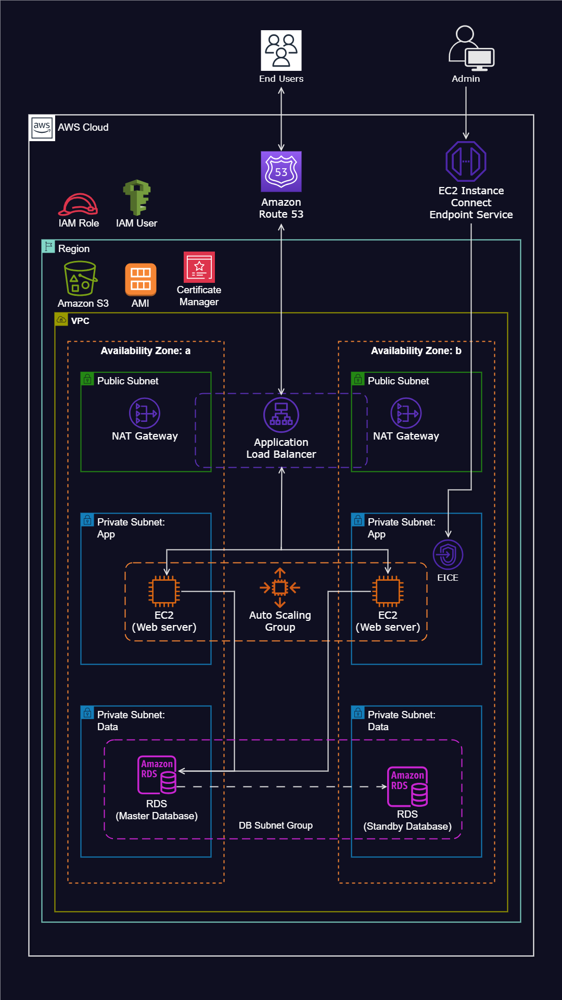

# Dynamic Website Deployment on AWS

## Overview
This project demonstrates the deployment of a dynamic website on AWS using various AWS services. The infrastructure is designed with high availability, security, and scalability in mind. The GitHub repository contains deployment scripts and a reference architecture diagram.

## AWS Services Utilized

1. **Virtual Private Cloud (VPC)**: Configured with public and private subnets spanning two availability zones to enhance fault tolerance.
2. **Internet Gateway**: Enables internet connectivity for resources within the VPC.
3. **Security Groups**: Serve as a network firewall to control inbound and outbound traffic.
4. **Availability Zones**: Used two availability zones to improve system reliability.
5. **Public Subnets**:
   - Used for infrastructure components like the NAT Gateway and Application Load Balancer.
6. **EC2 Instance Connect Endpoint**: Securely connects to assets within public and private subnets.
7. **Private Subnets**:
   - Hosted web servers (EC2 instances) in private subnets for enhanced security.
   - Allowed instances in the private Application and Data subnets to access the internet via the NAT Gateway.
8. **EC2 Instances**:
   - Hosted the website on EC2 instances.
9. **Application Load Balancer (ALB)**:
   - Configured with a target group to distribute web traffic evenly to an Auto Scaling Group across multiple availability zones.
10. **Auto Scaling Group**:
    - Automatically manages EC2 instances to ensure availability, scalability, fault tolerance, and elasticity.
11. **AWS Certificate Manager**:
    - Secured application communications using SSL/TLS certificates.
12. **Amazon Simple Notification Service (SNS)**:
    - Configured to send alerts related to activities within the Auto Scaling Group.
13. **Route 53**:
    - Registered the domain and set up a DNS record.
14. **Amazon S3**:
    - Used to store application code.

## Repository Contents
- **Deployment Scripts**: Includes infrastructure as code (IaC) scripts for automated resource provisioning.
- **Reference Diagram**: Illustrates the architecture and resource relationships.

## Deployment Steps
1. Clone the GitHub repository.
2. Use Terraform or AWS CloudFormation to deploy the infrastructure.
3. Ensure proper security group configurations for restricted access.
4. Deploy the website on the provisioned EC2 instances.
5. Configure Route 53 DNS settings for domain name resolution.
6. Verify the Application Load Balancer distributes traffic correctly.
7. Set up monitoring and alerting using SNS.

## Security Considerations
- Web servers are placed in private subnets to minimize exposure.
- Security Groups enforce least privilege access.
- SSL/TLS encryption ensures secure communication.
- NAT Gateway allows internet access while maintaining security controls.

## Conclusion
This AWS-based deployment ensures a secure, scalable, and highly available dynamic website. The infrastructure is designed to handle varying loads while maintaining security best practices.

For more details, refer to the deployment scripts and reference diagram in the GitHub repository.

## Data Migration Script
#!/bin/bash

S3_URI=s3://divine-sql-files/V1__shopwise.sql
RDS_ENDPOINT=dev-rds-db.cdga88iu0kex.us-west-1.rds.amazonaws.com
RDS_DB_NAME=applicationdb
RDS_DB_USERNAME=thalia
RDS_DB_PASSWORD=Azerty19901996

# Update all packages
sudo yum update -y

# Download and extract Flyway
sudo wget -qO-  https://download.red-gate.com/maven/release/com/redgate/flyway/flyway-commandline/11.3.4/flyway-commandline-11.3.4-linux-x64.tar.gz | tar -xvz 

# Create a symbolic link to make Flyway accessible globally
sudo ln -s $(pwd)/flyway-11.3.4/flyway /usr/local/bin

# Create the SQL directory for migrations
sudo mkdir sql

# Download the migration SQL script from AWS S3
sudo aws s3 cp "$S3_URI" sql/

# Run Flyway migration
flyway -url=jdbc:mysql://"$RDS_ENDPOINT":3306/"$RDS_DB_NAME"?allowPublicKeyRetrieval=true \
  -user="$RDS_DB_USERNAME" \
  -password="$RDS_DB_PASSWORD" \
  -locations=filesystem:sql \
  migrate

  ## Script to install the website on EC2
  # This command indicates that the script should be interpreted and executed using the Bash shell
#!/bin/bash

# This command updates all the packages on the server to their latest versions
sudo yum update -y

# This series of commands installs the Apache web server, enables it to start on boot, and then starts the server immediately
sudo yum install -y httpd
sudo systemctl enable httpd 
sudo systemctl start httpd

# This command installs PHP along with several necessary extensions for the application to run
sudo dnf install -y \
php \
php-pdo \
php-openssl \
php-mbstring \
php-exif \
php-fileinfo \
php-xml \
php-ctype \
php-json \
php-tokenizer \
php-curl \
php-cli \
php-fpm \
php-mysqlnd \
php-bcmath \
php-gd \
php-cgi \
php-gettext \
php-intl \
php-zip

## These commands Installs MySQL version 8
# Install the MySQL Community repository
sudo wget https://dev.mysql.com/get/mysql80-community-release-el9-1.noarch.rpm 
#
# Install the MySQL server
sudo dnf install -y mysql80-community-release-el9-1.noarch.rpm
sudo rpm --import https://repo.mysql.com/RPM-GPG-KEY-mysql-2023
dnf repolist enabled | grep "mysql.*-community.*"
sudo dnf install -y mysql-community-server 
#
# Start and enable the MySQL server
sudo systemctl start mysqld
sudo systemctl enable mysqld

# This command enables the 'mod_rewrite' module in Apache on an EC2 Linux instance. It allows the use of .htaccess files for URL rewriting and other directives in the '/var/www/html' directory
sudo sed -i '/<Directory "\/var\/www\/html">/,/<\/Directory>/ s/AllowOverride None/AllowOverride All/' /etc/httpd/conf/httpd.conf

# Environment Veriable
S3_BUCKET_NAME=thalia-project-web-file

# This command downloads the contents of the specified S3 bucket to the '/var/www/html' directory on the EC2 instance
sudo aws s3 sync s3://"$S3_BUCKET_NAME" /var/www/html

# This command changes the current working directory to '/var/www/html', which is the standard directory for hosting web pages on a Unix-based server
cd /var/www/html

# This command is used to extract the contents of the application code zip file that was previously downloaded from the S3 bucket
sudo unzip shopwise.zip

# This command recursively copies all files, including hidden ones, from the 'shopwise' directory to the '/var/www/html/'
sudo cp -R shopwise/. /var/www/html/

# This command permanently deletes the 'shopwise' directory and the 'shopwise.zip' file.
sudo rm -rf shopwise shopwise.zip

# This command set permissions 777 for the '/var/www/html' directory and the 'storage/' directory
sudo chmod -R 777 /var/www/html
sudo chmod -R 777 storage/

# This command will open th vi editor and allow you to edit the .env file to add your database credentials 
sudo vi .env

# This command will restart the Apache server
sudo service httpd restart
